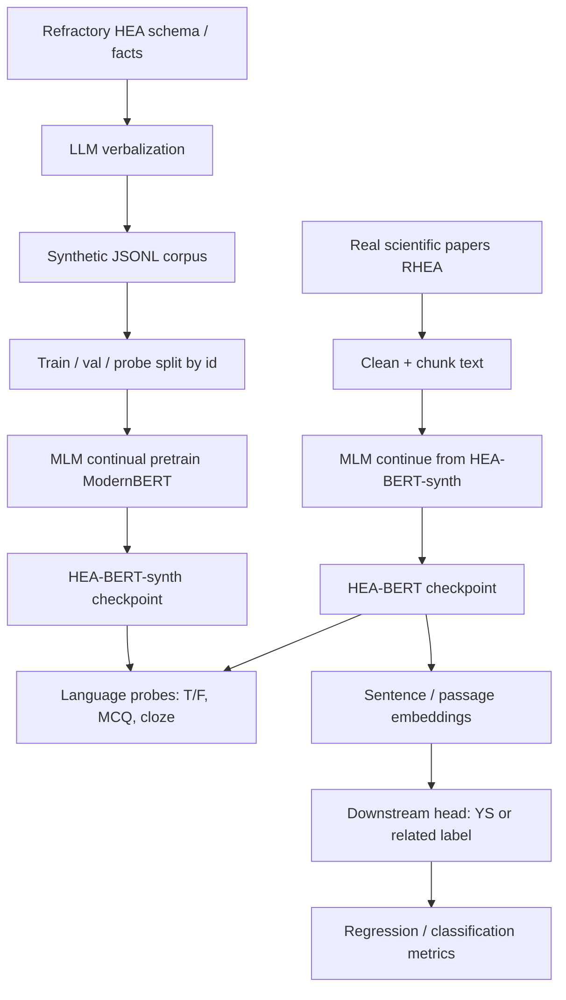

# Refractory HEA-BERT — Architecture Overview and Roadmap

**Project:** Domain-adapted encoder (ModernBERT → HEA-BERT) for refractory high-entropy alloys  
**Scope:** Refractory HEAs only (e.g. Nb, Mo, Ta, W, V, Zr, Hf, Re, Ti-bearing refractory systems)  
**Base model:** ModernBERT (Base ~137–139M preferred; Large ~325M if compute allows)  
**Training objective (core):** Masked Language Modeling (MLM) continual pre-training  
**Downstream use:** Frozen or lightly tuned embeddings for property-related prediction  
**Language evaluation:** True/False, MCQ, and fill-in-the-blank (cloze) probes

This document is the build spec: what to implement, in what order, with which data contracts, metrics, and failure modes.

---

## 1. Problem statement

Scientific text on refractory HEAs is sparse, jargon-heavy, and poorly represented in general English pre-training. The project builds a **domain-specialized encoder** that:

1. Understands refractory-HEA language (compositions, processing routes, microstructure, mechanical trends).
2. Is adapted first on **LLM-generated synthetic scientific prose**, then on **real papers**.
3. Yields **embeddings** usable for downstream prediction (e.g. yield strength / related mechanical trends).
4. Is tested with **exam-style probes** (T/F, MCQ, cloze) that measure domain understanding after each training stage.

**Non-goals (v1):**

- Decoder / generative QA as the primary model (no RAG chatbot as the thesis core).
- Phase-field / grain-growth surrogate (U-Net, FNO, Swin) — related HEA physics, separate architecture.
- Light / FCC Cantor-only HEAs as a first-class data mix (optional ablation later, not the main corpus).

---

## 2. Design principles

| Principle | Implication |
|-----------|-------------|
| Text in, not raw tables | Tabular composition/process/property rows are verbalized (LLM or templates) before MLM. |
| Curriculum of data | Synthetic HEA prose first, real papers second. |
| Separate products | (A) language encoder via MLM, (B) prediction head on embeddings. |
| Separate evaluations | Cloze/MCQ/T/F for language; MAE/RMSE/R² for properties. |
| No train/test leakage | Probe items must not be paraphrases of training passages with the same `id`. |
| Synthetic ≠ ground truth | LLM text teaches **register and co-occurrence**; facts for exams should be held-out or human-checked. |

---

## 3. System architecture

### 3.1 Logical view

```
┌─────────────────────────────────────────────────────────────────┐
│                         DATA LAYER                               │
│  Schema JSONL  →  Synthetic corpus  →  Paper corpus  →  Splits  │
└────────────────────────────┬────────────────────────────────────┘
                             │
                             ▼
┌─────────────────────────────────────────────────────────────────┐
│                    ENCODER ADAPTATION LAYER                      │
│  ModernBERT  →  MLM on synthetic  →  HEA-BERT-synth              │
│              →  MLM on papers     →  HEA-BERT                    │
└────────────────────────────┬────────────────────────────────────┘
                             │
              ┌──────────────┴──────────────┐
              ▼                             ▼
┌─────────────────────────┐    ┌──────────────────────────────────┐
│  LANGUAGE EVAL LAYER    │    │     DOWNSTREAM HEAD LAYER        │
│  Cloze / MCQ / T/F      │    │  Pool embeddings → MLP/linear    │
│  vs vanilla ModernBERT  │    │  Predict YS / hardness / …       │
└─────────────────────────┘    └──────────────────────────────────┘
```

### 3.2 End-to-end pipeline



### 3.3 Model stack

| Component | Choice | Role |
|-----------|--------|------|
| Tokenizer | ModernBERT tokenizer (unchanged v1) | WordPiece/BPE as shipped; no HEA-specific tokenizer unless OOV is severe |
| Backbone | `answerdotai/ModernBERT-base` | Bidirectional encoder |
| Adaptation loss | MLM (standard 15% mask; optional domain mask bias — see §7) | Domain language |
| Pooling | Mean of last hidden state (primary); `[CLS]` ablation | Embedding vector |
| Prediction head | 1–2 layer MLP on pooled vector | Mechanical property |
| Optional later | Linear probes for NER (alloy, process, temperature) | Extraction, not required for v1 |

**Why ModernBERT over RoBERTa / DeBERTa-v3:** longer efficient context, modern pre-training recipe, Base size fits Colab; AlloyBERT-style RoBERTa remains a **literature baseline**, not the training starting point.

---

## 4. Data architecture

### 4.1 Canonical record (synthetic)

Every synthetic document is one JSON object per line (JSONL). This matches the generation format already in use.

```json
{
  "id": "6c6c3584ea15be1f",
  "text": "The refractory high-entropy alloy VZrMoTa ...",
  "composition": "VZrMoTa",
  "processing_route": "mechanical alloying followed by hot pressing",
  "subtopic": "qualitative tensile strength trends relative to composition and grain size",
  "style": "a materials science journal abstract",
  "kind": "single"
}
```

**Field contracts**

| Field | Type | Rules |
|-------|------|--------|
| `id` | string | Stable unique key; **split unit** (never leak an id across train and probe) |
| `text` | string | 1–4 paragraphs; scientific English; no markdown |
| `composition` | string | RHEA formula(s); comparative rows use `"A vs B"` |
| `processing_route` | string | Normalized later via a small synonym map (SPS, HIP, DED, MA+HP, …) |
| `subtopic` | string | Controlled vocabulary (see §4.3) |
| `style` | string | e.g. journal abstract, methods, textbook passage |
| `kind` | `"single"` \| `"comparative"` | One alloy vs two-alloy contrast |

Optional fields (add when available, do not invent numbers):

```json
{
  "property_mentions": ["UTS", "YS", "hardness", "elongation", "K_IC", "fatigue"],
  "source": "llm_v1",
  "model": "…",
  "prompt_hash": "…",
  "verified": false
}
```

### 4.2 Paper records

```json
{
  "id": "paper_doi_or_hash",
  "text": "chunk of body text",
  "chunk_index": 0,
  "title": "…",
  "year": 2021,
  "composition": null,
  "source": "pdf"
}
```

Chunking: overlapping windows (~256–512 tokens, stride 64–128) so MLM sees local scientific context without blowing GPU memory.

### 4.3 Subtopic taxonomy (refractory HEA)

Keep generation and evaluation balanced across these buckets:

1. Composition vs solid-solution / lattice-distortion strengthening  
2. Grain size vs strength / hardness (Hall–Petch-type)  
3. Processing route vs density, porosity, grain structure (MA+HP, SPS, AM/DED, casting)  
4. Strength–ductility trade-off  
5. Fracture toughness and fatigue vs defects / porosity  
6. Phase stability / BCC vs secondary phases (qualitative)  
7. Thermal / high-temperature strength (creep-adjacent qualitative)  
8. Comparative statements between two RHEAs  

### 4.4 Verbalization rule (tables → text)

Do **not** concatenate CSV columns into the encoder.

**Path A — templates (high factual control):**

```
The refractory HEA {composition} processed by {route} shows {trend} in {property} when {microstructure_factor} increases.
```

**Path B — LLM (style diversity):**  
Condition the LLM on schema + allowed claims. Prefer Path A for any sentence that will later become a T/F item.

**Hybrid (recommended):** ~40–60% templated / slot-filled, ~40–60% free LLM prose in journal/methods/textbook styles (as in current samples).

### 4.5 Splits

| Split | Fraction | Rule |
|-------|----------|------|
| `train` | ~80% of synthetic ids | MLM only |
| `val` | ~10% | MLM perplexity / MLM accuracy |
| `probe_pool` | ~10% ids **never** in MLM | Source for T/F, MCQ, cloze |

Additionally:

- **Composition hold-out (optional but strong):** keep 2–3 alloy systems (e.g. all `NbTiTa` texts) entirely out of train to test generalization.  
- **Paper split:** by **paper id**, not by random chunks (avoids same paper in train and test).

---

## 5. Model architecture (training and inference)

### 5.1 MLM adaptation (HEA-BERT)

```
input_ids, attention_mask
        │
        ▼
┌───────────────────┐
│ ModernBERT encoder │
└─────────┬─────────┘
          │ hidden states
          ▼
┌───────────────────┐
│ MLM head (tied)    │  Cross-entropy on masked tokens
└───────────────────┘
```

- Initialize from Hugging Face ModernBERT weights.  
- Train with standard MLM; save optimizer + RNG for resume on Colab.  
- Checkpoints:
  - `hea-bert-synth` after synthetic MLM  
  - `hea-bert` after paper MLM  

### 5.2 Embedding extraction

For a passage \(x\):

1. Tokenize (truncate/pad to `max_length`, start with 512; ModernBERT can go longer if VRAM allows).  
2. Forward pass, no MLM masks.  
3. **Mean pool** token hidden states, masking pads.  
4. L2-normalize for retrieval-style analyses (optional); **do not** normalize if the MLP head is trained on raw means (pick one and freeze the protocol).

### 5.3 Downstream prediction head

```
pooled embedding (H)
        │
        ▼
  Dropout → Linear → GELU → Linear → ŷ
```

- **Regression:** YS, UTS, hardness (when numeric labels exist).  
- **Classification (optional):** trend labels (`increases` / `decreases` / `trade-off`) if numeric data is too scarce.  
- Train head with backbone **frozen** first (fair test of embeddings); unfreeze last 2 layers only if frozen head saturates.

### 5.4 Language probe heads (evaluation only)

Probes should **not** require a new generative model.

| Probe | Mechanism |
|-------|-----------|
| Cloze | Mask the target span; score gold token(s) vs vocabulary / candidate list |
| MCQ | Encode `context + option` or `question + option`; pick option with lowest MLM loss or highest likelihood |
| T/F | Encode statement; compare MLM pseudo-likelihood of statement vs negated statement, **or** a small calibrated classifier on frozen embeddings trained on a tiny labeled probe set |

Prefer **likelihood ranking** for MCQ/cloze so evaluation stays close to the MLM objective.

---

## 6. Training recipe

### 6.1 Stage 0 — Baseline

- Load `ModernBERT-base`.  
- Run language probes **before** any HEA training. This is the number you must beat.

### 6.2 Stage 1 — Synthetic MLM

| Hyperparameter | Starting point (Base, Colab GPU) |
|----------------|----------------------------------|
| Max length | 512 |
| Mask probability | 0.15 (standard); optional 0.30 ablation |
| Batch size | Fit VRAM (gradient accumulation to effective 32–128) |
| LR | 1e-4 to 5e-5, AdamW, linear warmup 6% |
| Weight decay | 0.01 |
| Epochs | 1–3 on synthetic (watch val MLM loss; stop if val rises) |
| Precision | bf16 if available, else fp16 |
| Seed | Fixed (e.g. 42) |

**Domain-aware masking (optional upgrade):** raise mask rate on entity-like spans (composition strings, process phrases, temperatures) using regex/gazetteers. Do not start here; add after a working standard MLM run.

### 6.3 Stage 2 — Paper MLM

- Continue from `hea-bert-synth`.  
- Lower LR (e.g. 1e-5 to 2e-5).  
- Fewer epochs (papers are noisier; overfitting to PDF artifacts is easy).  
- Same val protocol on a **paper** val split.

### 6.4 Stage 3 — Downstream head

- Freeze encoder.  
- Train MLP on labeled set with standard scaler on \(y\).  
- Nested or grouped split by composition so the same alloy does not dominate both train and test.

### 6.5 Compute assumptions

- Google Colab GPU/TPU, interrupted sessions → **frequent checkpoints**, small `save_steps`.  
- Prefer Base; attempt Large only after the full pipeline works on Base.

---

## 7. Evaluation architecture

### 7.1 Two evaluation tracks

**Track A — Domain language (required for thesis claim “HEA-BERT understands RHEA text”)**

| Format | Item source | Metric |
|--------|-------------|--------|
| Fill-in-the-blank | Mask composition, process, Hall–Petch keyword, temperature band | Exact match, token F1, top-5 |
| MCQ (4-way) | One gold + 3 hard negatives (wrong process, similar RHEA, reversed trend) | Accuracy |
| True/False | Atomic claims; avoid 50/50 trivia | Accuracy; report majority-class baseline |

**Track B — Embeddings → prediction (required if you claim mechanical prediction)**

| Task | Metric |
|------|--------|
| YS / hardness regression | MAE, RMSE, \(R^2\) |
| Trend classification | Accuracy, macro-F1 |

Always report **vanilla ModernBERT** (and, if feasible, a public materials encoder) on **identical** items.

### 7.2 Probe construction rules

1. Build probes from `probe_pool` ids or from **real paper** sentences, not from `train` text.  
2. Cloze targets should be **short, unambiguous** (`VZrMoTa`, `spark plasma sintering`, `Hall-Petch`).  
3. MCQ negatives must be domain-plausible, not nonsense.  
4. T/F items that assert a **quantitative or causal law** should be `verified: true` or dropped.  
5. Publish a frozen `probes.jsonl` so runs are comparable.

### 7.3 Example probe shapes (illustrative)

**Cloze**

```
The NbTiTa alloy produced by [MASK] [MASK] [MASK] showed higher hardness for finer grains.
```
(Gold: vacuum spark plasma sintering / SPS — accept a small alias list.)

**MCQ**

```
Q: In Hall–Petch-type reasoning for sintered NbTiTa, finer equiaxed grains typically:
A) Increase yield strength and hardness
B) Decrease boundary area and raise toughness only
C) Eliminate all porosity
D) Reverse the strength–grain size relation
```

**T/F**

```
T/F: Coarser grains from slower cooling generally lower YS/UTS but can improve strain-to-failure.
```

### 7.4 Success criteria (suggested)

| Gate | Criterion |
|------|-----------|
| Stage 1 | Probe accuracy **> baseline ModernBERT** by a clear margin on cloze + MCQ |
| Stage 2 | Further gain on **paper-derived** probes; synthetic probes must not collapse (catastrophic forgetting check) |
| Stage 3 | Frozen-embedding head beats a **bag-of-composition features** or TF-IDF baseline, or you report that it does not (honest negative result is valid) |

---

## 8. Repository layout (implementation map)

```
BTP/
├── ARCHITECTURE.md                 # this file
├── README.md
├── configs/
│   ├── mlm_synth.yaml
│   ├── mlm_papers.yaml
│   └── downstream.yaml
├── data/
│   ├── raw/                        # pdfs, csv property tables (gitignored if large)
│   ├── synthetic/                  # jsonl as in §4.1
│   ├── papers/                     # chunked jsonl
│   └── probes/                     # frozen T/F, mcq, cloze
├── src/
│   ├── data/
│   │   ├── schema.py               # pydantic/dataclasses for records
│   │   ├── splits.py               # id-level splits, composition hold-out
│   │   └── collator.py             # MLM collator
│   ├── models/
│   │   ├── load.py                 # ModernBERT + tokenizer
│   │   └── pooling.py
│   ├── train/
│   │   ├── train_mlm.py
│   │   └── train_head.py
│   ├── eval/
│   │   ├── cloze.py
│   │   ├── mcq.py
│   │   ├── true_false.py
│   │   └── regression.py
│   └── generate/
│       └── verbalize.py            # optional template/LLM wrappers
├── notebooks/                      # Colab entrypoints
├── scripts/                        # launchers
└── artifacts/                      # checkpoints, metrics json (gitignored)
```

---

## 9. Roadmap (build order)

### Milestone M0 — Scaffold (week 1)

- Repo layout, configs, dataset dataclass, one dummy JSONL, smoke-test forward pass of ModernBERT.  
- **Exit:** `train_mlm.py --max-steps 2` runs on CPU/GPU.

### Milestone M1 — Synthetic corpus + splits (week 1–2)

- Scale generation in the existing JSON schema; balance `subtopic`, `kind`, `style`.  
- Template subset for controllable claims.  
- Id-level train/val/probe split + composition hold-out.  
- **Exit:** documented corpus stats (counts per subtopic/composition).

### Milestone M2 — HEA-BERT-synth (week 2–3)

- Full synthetic MLM; val MLM loss curve; checkpoint.  
- **Exit:** `hea-bert-synth` + training curves.

### Milestone M3 — Language probes v1 (week 3)

- Frozen probe files; cloze + MCQ + T/F runners.  
- Compare ModernBERT vs HEA-BERT-synth.  
- **Exit:** table of accuracies; error analysis (process vs composition vs mechanism).

### Milestone M4 — Papers + HEA-BERT (week 4–6)

- PDF text extract, chunk, paper-level split.  
- Continue MLM; re-run probes (synthetic + paper).  
- **Exit:** `hea-bert` and forgetting check.

### Milestone M5 — Embeddings and prediction (week 6–8)

- Pooling API; labeled mechanical dataset (even small).  
- Frozen head vs simple baselines.  
- **Exit:** Track B metrics and discussion of sample-size limits.

### Milestone M6 — Thesis artifacts (week 8+)

- Ablations: mask rate, frozen vs unfrozen, Base vs Large if possible.  
- Write methods: data, MLM, probes, leakage controls.  
- Optional: Light vs refractory split is **out of scope** unless extra data appears.

---

## 10. Risks and mitigations

| Risk | Mitigation |
|------|------------|
| LLM hallucinations in synthetic text | Templates for probe-worthy facts; `verified` flag; do not exam-test unverified causal claims |
| Model learns LLM style, not metallurgy | Stage 2 papers; style-diverse generation; composition hold-out |
| Probe leakage | Split by `id`; never generate questions from train `text` |
| T/F ~50% noise | Harder items, report chance baseline, weight cloze/MCQ more |
| Tiny labeled YS set | Frozen encoder + simple head; report uncertainty; avoid overclaiming |
| Colab disconnects | Checkpoint often; log `step`, seed, config hash |
| Tokenizer OOV on odd formulae | Monitor unk rate; do not custom-train tokenizer in v1 unless unk is high |

---

## 11. What “done” looks like

A complete architecture delivery for this BTP is:

1. **HEA-BERT-synth** and **HEA-BERT** checkpoints with configs and seeds.  
2. A **frozen probe suite** (T/F, MCQ, cloze) with leakage-safe splits.  
3. A **results table**: baseline ModernBERT vs synth vs papers.  
4. An **embedding → head** experiment (even if the dataset is small), with honest metrics.  
5. A methods write-up that matches this document (synthetic JSON schema, two-stage MLM, two eval tracks).

That is the architecture to implement; training code and data scale follow this spec rather than the other way around.
